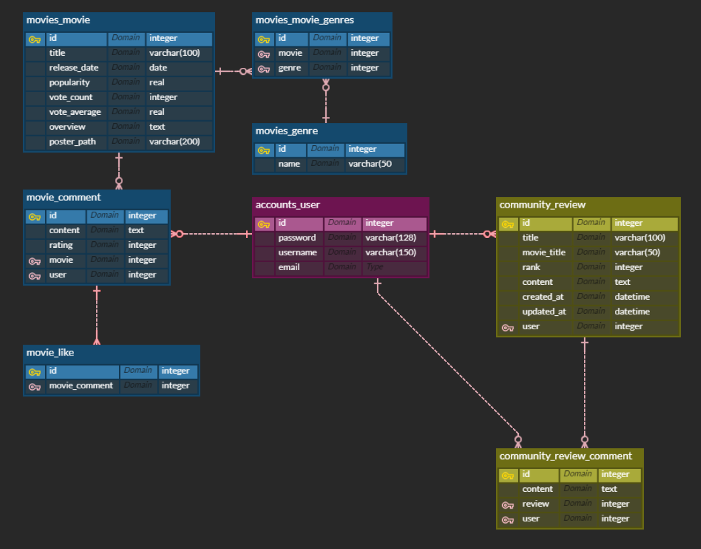

# 🎬 FINAL-PJT "MOCO"

> #### 🔹 ***MOCO란?*** 
>
> ​				Movie Community의 약자로 영화 데이터 조회 및 커뮤니티 사이트를 제공하는 홈페이지 입니다.

# 	o. 프로젝트 기간

##### 			💜 시작일 : 2022-05-20 (Fri)

##### 			🧡 기획 및 모델링 : 2022-05-20 (Fri)

##### 			💛 백엔드 구현 : 2022-05-20 (Fri) ~  05-24 (Tue)

##### 			💚 프론트엔드 구현 : 2022-05-23 (Mon) ~ 05-26(Thu)

##### 			💙 발표일 : 2022-05-27 (Fri)

---

## 	I. 팀원 정보 및 업무 분담 내역

##### 			🤴 <u>강병수</u> (팀장) 

   -  **백엔드** => 서버 구축 및 주요 기능 구현 담당, 발표 담당

##### 			👸 <u>김가흔</u> 

- **프론트엔드** => UI 및 컴포넌트 구성 담당, PPT 및 개발일지 담당

---

## 	II. 목표 서비스 구현 및 실제 구현 정도

#### 			🎯목표 서비스 : 영화 커뮤니티 "MOCO"

##### 							-  TMDB 데이터 및 JSON Data를 활용한 영화 데이터 제공

##### 							-  영화 추천 알고리즘 : 장르별 / 감독별 / 최신순 / 평점순 / 관객수

##### 							-  CRUD 구현을 기반으로 커뮤니티 페이지 제공

##### 							-  USER accounts를 바탕으로 사용자 인증 

---

## 	III. 데이터베이스 모델링(ERD)

---

## 	IV. 필수 기능에 대한 설명

#### 			💻 Using : <u>VSCODE, HTML, CSS, JS, Axios, BootStrap, FontAwsome</u>

#### 			✔   <u>CRUD</u>

##### 						-	*CREATE*  : 게시글 작성, 한줄평 작성, 리뷰 작성, 댓글 작성

##### 						-	*READ*  : 영화 정보 및 디테일 페이지 조회 가능

##### 						-	*UPDATE*  : 사용자 인증된 유저만 수정 가능

##### 						-	*DELETE*  :  사용자 인증된 유저만 삭제 가능

#### 			✔   <u>Rating</u>

##### 						-	JS 기능을 바탕으로 드래그를 통해 별점으로  평점을 표현할 수 있도록 기능 구현

#### 			✔   <u>Movie Recommend</u>

##### 						-	장르 코드를 이용하여 일치하는 장르로 나만의 영화 추천 (Django DB 기반)

##### 						-	현재상영작, 차기상영작, 관객수, 평점순을 바탕으로 내림차수를 통한 영화 추천

- ###### axios 통신 데이터를 기반으로 TMDB 데이터를 사용하여 해당 알고리즘 완성

#### ✔   <u>Authority</u>

##### -    superuser의 경우, 데이터베이스 영화를 추가하거나 삭제할 수 있는 권한이 주어짐

#### ✔   <u>Search</u>

##### -    TMDB Movie Search를 기반으로 영화 정보 받아오기

##### -    검색 결과시 해당 영화가 데이터 베이스에 없는 경우, 해당 영화를 데이터 베이스에 추가 가능

##### -    검색 결과시 해당 영화가 데이터 베이스에 있는 경우, 중복 추가 경고 메세지창 출력

---

## 	V. 기타 (느낀 점)

#### 			🤴강병수 (백엔드)

> 처음으로 백과 프론트를 나누어 작업을  했습니다.  저는 그 중 백엔드 부분을 담당하였는데, 백에만 전념할 수 있어서 편하게  작업할 수 있었습니다. 이번 프로젝트의 경우 django에 vanila js를 활용하여 만들었는데 결과보다는 과정중에서 수업내용을 복기하거나 혹은 제가 필요한 기술을 인터넷에서 찾아 실제로 적용하는방법을 배우는 등의 의미가 큰 것 같습니다. 제가 필요한 기능을 구현하기 위해 database seeding에 사용했던 기존 json 파일을 수정하여 새로 만들기도 해보고 tmdb api에서 데이터를 받아 기존 database에 넣어보는 등 데이터 관련 부분에대해 의미있게 다뤄본 것 같습니다.

#### 			👸김가흔 (프론트엔드)

> 이전 과제 PJT는 정해진 틀 안에서 기능별로 팀원과 나누어 진행해왔다면, 이번 PJT는 모든 과정을 주도적으로 해내어야 한다는 점에서 많은 점을 배울 수 있었습니다. 우선, PJT를 위한 계획과 명세서 작성 과정을 통해서 주제에 맞는 테마를 잡고 어떤 기능들을 구현하고 어떻게 배치할지에 대해서 직접 생각할 수 있었습니다. 이를 바탕으로 백엔드와 프론트엔드의 업무를 분담하여 PJT를 진행하였고, 서로 구현한 부분의 보완점과 문제점을 함께 해결해 나가는 시간을 가졌습니다. 이러한 소통을 통해서 서로 원하는 방향과 기존의 계획했던 것보다 더 좋은 결과물을 만들어낼 수 있었습니다.  마지막으로 이번 PJT에서 프론트엔드를 맡아 여러 구성들을 고민해보고 직접 구현해보면서 어떻게 하면 사용자의 입장에서 편안하게 접근할 수 있을까에 대한 고민을 가장 많이 했습니다. 더불어, 백엔드 파트너가 구현해 놓은 기능들을 어떻게 하면 효율적으로 잘 이용하도록 유도할 수 있을까에 대한 생각도 할 수 있었습니다.

